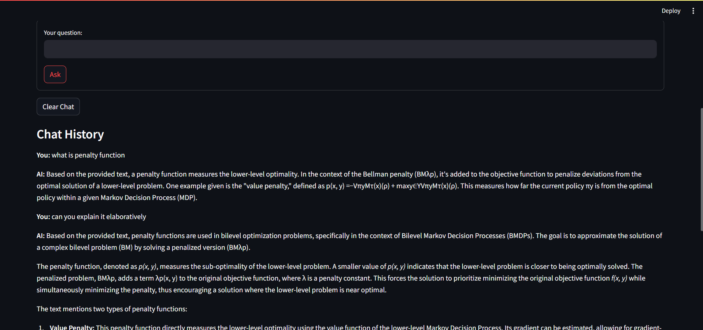

# PDF Assistant

PDF Assistant is an interactive tool that lets you upload PDF documents and engage with them intelligently chat with your PDFs, generate summaries, create MCQs, and build a learning timetable. Built with Streamlit and powered by Google Gemini Flash, this project is designed for students, educators, and professionals seeking a smarter way to explore and learn from documents.

## Features

- **PDF Upload & Processing**: Seamlessly upload and parse PDF files.
- **Conversational Chat**: Ask contextual questions and receive answers using advanced LLMs.
- **Automatic Summarization**: Get concise summaries of your document.
- **MCQ Generation**: Instantly create multiple-choice questions for self-testing.
- **Personalized Study Timetable**: Build a custom study plan based on your PDF content.
- **Local & Private**: Runs on your machine; your documents stay private.
- **Resource-Aware Usage**: Handles Gemini Flash API token limits responsibly.

## Demo Screenshots


  
  


## Requirements

Contents of `requirements.txt`:


## Gemini Flash API Limits

- **Token Limit**: The Google Gemini Flash model currently supports up to 250,000 tokens per minute (as of July 22, 2025).
- **Implications**: Heavy usage, especially with multiple users, can hit this cap and result in throttling or errors.

## Project Structure
```
pdf-assistant/
│
├── app.py               # Streamlit frontend
├── backend.py           # Core backend functions
├── prompts.py           # Prompt templates for LLM calls
├── requirements.txt     # Dependencies
├── .env                 # Local API keys (not in version control)
├── README.md            # This documentation
└── screenshots        
```


## Getting Started

### 1. Clone the Repository

```
git clone https://github.com/yourusername/pdf-assistant.git
cd pdf-assistant
```

### 2. Install Dependencies
```
pip install -r requirements.txt
```
### 3. Configure the Gemini Flash API Key
* Sign up for Gemini API and get your API key or you can use any other LLM's API.
* Create a .env file in the root directory with the following content:
```
GEMINI_API_KEY=your_api_key_here
```
### 4. Run the Application
```
streamlit run app.py

```
## Usage
1. Open the web app in your browser (the terminal will show a local URL).
2. Upload a PDF via the interface.
3. Interact:
* Use the chat to ask questions about the PDF.
* Click available tools to generate summaries, MCQs, or a personalized study plan.

> Note: Always be mindful of the API token cap, especially if sharing with others. Each user should use their own API key if possible.

## Environment Variables
* Set your API key securely in .env. Do not share your API key in your public repo.

## Limitations
* **Not Deployed Online**: Only for local use due to API key security and rate limits.

* **API Key Requirement**: Each user must supply their own Gemini API key.

* **Token Cap**: Maximum of 250,000 tokens per minute (subject to change by Google).

* **PDF Quality**: Very low-quality or scanned PDFs with poor OCR may have extraction issues.

## Contributing
* Contributions, bug reports, and feature requests are very welcome! Please open an issue or submit a pull request.

## FAQ & Troubleshooting
* **App won’t run?** Ensure all dependencies are installed and your Python version meets requirements.

* **API key error?** Make sure GEMINI_API_KEY is set in your .env file and not accidentally committed to your repo.

* **Hitting token limits?** Avoid large batch jobs, or consider upgrading to a higher quota.

## Contact
* Have suggestions or feedback? Open an issue or start a discussion on the repository.

